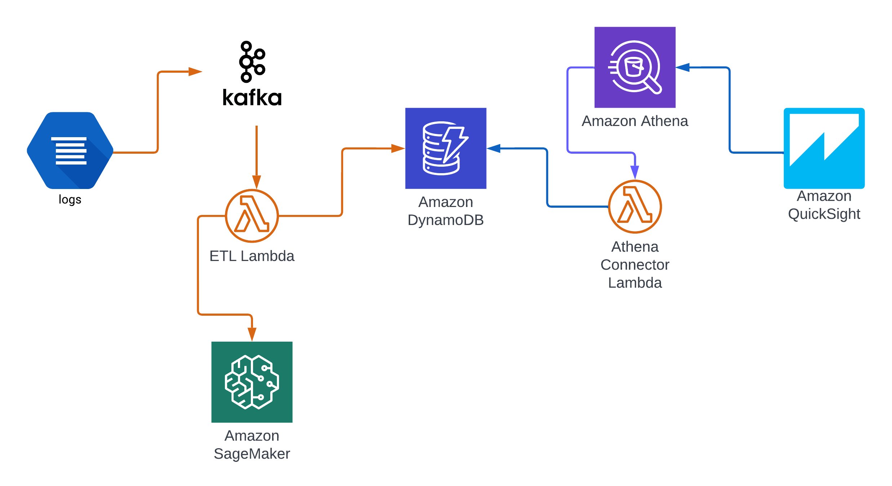

# Kafka Log Processing Pipeline on AWS with EKS, Lambda, SageMaker, and QuickSight

This project demonstrates a comprehensive data pipeline for processing and analyzing Kafka logs on AWS, built using Terraform, EKS, and other AWS services. The pipeline streams Kafka logs to AWS Lambda, processes them through a trained SageMaker RCF (Random Cut Forest) model, stores results in DynamoDB, and visualizes the data using Amazon QuickSight.

## Architecture Overview

### AWS Services Used:
1. **VPC, EKS Cluster, and ECR**: Provisioned via Terraform.
2. **DynamoDB**: Used to store processed log data.
3. **Lambda**: Invoked by Kafka logs, which sends data to a SageMaker RCF model and DynamoDB.
4. **S3 Bucket**: Stores the trained RCF model for SageMaker.
5. **Amazon QuickSight**: Visualizes the data from DynamoDB.

### Components:
1. **ArgoCD**: Used for GitOps-based deployment of resources on EKS.
2. **AWS Load Balancer Controller**: Manages ingress traffic.
3. **External-DNS**: Automatically creates DNS records in Route53.
4. **Kafka and Kafka Producer**: Kafka streams logs, and the producer generates log events.
5. **SageMaker**: The RCF model in SageMaker scores log data to detect anomalies.
6. **Docker Image**: The Kafka producer is built using a Dockerfile, pushed to ECR, and deployed on the EKS cluster.

## Setup Instructions

### 1. Infrastructure Setup (Terraform)
Use Terraform to provision the following AWS resources:
- **VPC**: A Virtual Private Cloud where the EKS cluster will reside.
- **EKS Cluster**: The Elastic Kubernetes Service (EKS) cluster to run Kafka, Kafka Producer, and other applications.
- **ECR**: Elastic Container Registry to store Docker images for the Kafka producer.
- **S3 Bucket**: To store the trained SageMaker model.
- **DynamoDB Table**: To store the processed log data.
- **Lambda Function**: For processing Kafka logs and calling SageMaker.
- **SageMaker Endpoint**: Used by Lambda to get an RCF score for each log.

### 2. Deploy Kubernetes Resources via ArgoCD
After the infrastructure is provisioned:
- Deploy ArgoCD to EKS.
- Use ArgoCD to deploy:
  - **AWS Load Balancer Controller**
  - **External-DNS** (for automatic Route53 DNS management)
  - **Kafka and Kafka Producer**

### 3. Build and Deploy Kafka Producer
- **Docker Image**: The Kafka producer is containerized in a Docker image.
- **Push to ECR**: Build and push the producer image to the Elastic Container Registry (ECR).
- **Deploy to EKS**: The Kafka producer generates log events and publishes them to the Kafka topic.

### 4. SageMaker Model Training and Deployment
- **Train the RCF Model**: The Random Cut Forest (RCF) model is trained in SageMaker for anomaly detection.
- **Store in S3**: The trained model is stored in the S3 bucket.
- **Create Endpoint**: A SageMaker endpoint is created for real-time scoring.

### 5. Lambda Function Setup
- The Lambda function is triggered by Kafka logs and invokes the SageMaker endpoint to score the log data.
- **DynamoDB**: The processed log data, along with anomaly scores, is stored in DynamoDB.

### 6. Visualize Data in QuickSight
- **QuickSight Dashboard**: Create an Amazon QuickSight dashboard to visualize the data stored in DynamoDB. This allows you to gain insights from the Kafka logs, including anomaly detection results from SageMaker.

## Walkthrough

### Step 1: Provisioning with Terraform
Run the Terraform code to provision the entire infrastructure, including VPC, EKS cluster, ECR, DynamoDB, Lambda, S3, and the SageMaker endpoint.

```bash
terraform init
terraform apply
```
### Step 2: Deploy ArgoCD and Kubernetes Resources
After provisioning, deploy ArgoCD and use it to manage the following Kubernetes applications:

- AWS Load Balancer Controller
- External-DNS
- Kafka and Kafka Producer
### Step 3: Building and Pushing Docker Image
Build the Kafka producer Docker image and push it to ECR:

```bash
docker build -t kafka-producer .
docker tag kafka-producer:latest <account_id>.dkr.ecr.<region>.amazonaws.com/kafka-producer:latest
docker push <account_id>.dkr.ecr.<region>.amazonaws.com/kafka-producer:latest
```

### Step 4: Training and Deploying SageMaker Model
Train a Random Cut Forest (RCF) model for anomaly detection in SageMaker, store the model in S3, and create a real-time endpoint.

### Step 5: Lambda Function Invocation
The Lambda function processes each log received from Kafka, scores it using the SageMaker RCF model, and stores the data in DynamoDB.

### Step 6: Visualize Data with QuickSight
Connect QuickSight to DynamoDB and create a dashboard to visualize the log data and detect anomalies.

## Architecture Diagram


## QuickSight Dashboard Example


## Conclusion
This project showcases a complete log-processing pipeline using AWS managed services such as EKS, Lambda, SageMaker, and QuickSight. The solution allows you to process and visualize logs in real time, with anomaly detection powered by machine learning.